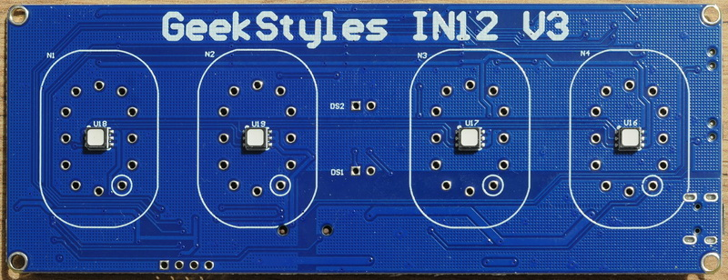
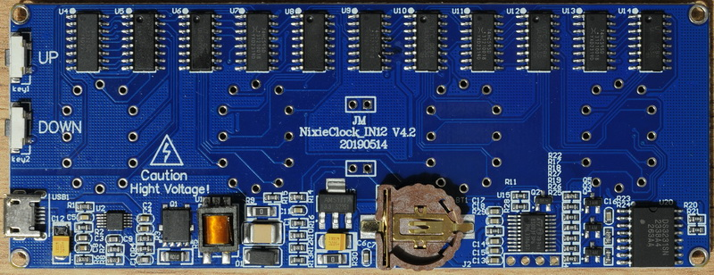

# IN12v3clock

Alternate firmware for the GeekStyles IN12 V3 Nixie nixieclock PCB.

## Version
- **1.00**: Initial release.

## Description
This firmware is designed for the IN12 V3 clock PCB, 
with frontside inscription: **GeekStyles IN12 V3**  
[](Photo/pcb_front_fullsize.JPG)
and the backside inscription: **JM NixieClock IN12 V4.2 20190514**.   
[](Photo/pcb_back_fullsize.JPG)
The STM8S003F3P6 microcontroller features 8 KB of Flash memory, 1 KB of RAM, and 128 bytes of EEPROM.

---

## Requirements
1. **Cosmic STM8 compiller + STVD**
2. **External Libraries**:
   - Added submodule: [STM8_headers](https://github.com/gicking/STM8_headers).

---

## Important Configuration
Before flashing the firmware, set the option byte `AFR0` in the ST Visual Programmer:
- **Port C5, C6 & C7**: Configure to **Alternate Function**.

---

## Pinout
### Microcontroller Pin Assignment
| Pin  | Signal                          | Description                                                        |
|------|---------------------------------|--------------------------------------------------------------------|
| 1    | PD4 (HS) UART1_CK/TIM2_CH1/BEEP | Input: Button UP with 10k pull-up resistor. Grounded when pressed.     |
| 2    | PD5 (HS) UART1_TX/AIN5          | Input: Button DOWN with 10k pull-up resistor. Grounded when pressed.   |
| 3    | PD6 (HS) UART1_RX               | Output: Drives colon neons (DS1 & DS2) through 1k resistor.       |
| 4    | NRST                            | Debug connector pin 3.                                             |
| 5    | PA1 OSCIN                       | Clock input.                                                       |
| 6    | PA2 OSCOUT                      | Clock output.                                                      |
| 7    | Vss                             | Ground.                                                            |
| 8    | Vcap                            | Decoupling capacitor.                                              |
| 9    | Vdd                             | +3.3V supply.                                                      |
| 10   | PA3 (HS) SPI_NSS/TIM2_CH3       | Reserved.                                                          |
| 11   | PB5 (T) I2C_SDA/TIM1_BKIN       | I2C SDA for DS3231 RTC with 10k pull-up resistor.                  |
| 12   | PB4 (T) I2C_SCL/ADC_ETR         | I2C SCL for DS3231 RTC with 10k pull-up resistor.                  |
| 13   | PC3 (HS) TIM1_CH3               | Drives LEDs (red) through 1k resistor.                             |
| 14   | PC4 (HS) TIM1_CH4               | Drives LEDs (blue) through 1k resistor.                            |
| 15   | PC5 (HS) SPI_SCK/TIM2_CH1       | Drives 595 shift register data input with 10k pull-up resistor.    |
| 16   | PC6 (HS) SPI_MOSI/TIM1_CH1      | Drives LEDs (green) through 1k resistor.                           |
| 17   | PC7 (HS) SPI_MISO/TIM1_CH2      | Drives 595 RCLK (latch) with 10k pull-up resistor.                 |
| 18   | PD1 (HS) SWIM                   | Debug connector pin 2.                                             |
| 19   | PD2 (HS) AIN3/TIM2_CH3          | Drives 595 SRCLK with 10k pull-up resistor.                        |
| 20   | PD3 (HS) AIN4/TIM2_CH2          | Drives 595 U4 OE.                                                  |

### Debug Connector
| Pin | Signal | Description |
|-----|--------|-------------|
| 1   | 3.3V   | Power supply. |
| 2   | SWIM   | Programming interface. |
| 3   | NRST   | Reset.       |
| 4   | GND    | Ground.      |

---

## Shift Register Wiring
The project uses a series of 74HC595 shift registers, driving 2003A darlington arrays to control the Nixie tubes. Here is the wiring layout:

- **Shift Registers (595)**: Connected in series to control multiple outputs.
- **Darlington Arrays (2003A)**: Drive the Nixie tubes from shift register outputs.

```
PC5
|
V
595 U4
Q0 -> 2003A U5  I1, O1-> N4 0
Q1 -> 2003A U5  I2, O2-> N4 1
Q2 -> 2003A U5  I3, O3-> N4 2
Q3 -> 2003A U5  I4, O4-> N4 3
Q4 -> 2003A U5  I5, O5-> N4 4
Q5 -> 2003A U5  I6, O6-> N4 5
Q6 -> 2003A U5  I7, O7-> N4 6
Q7 -> 2003A U6  I1, O1-> N4 7
|
V
595 U7
Q0 -> 2003A U6  I2, O2-> N4 8
Q1 -> 2003A U6  I3, O3-> N4 9
Q2 -> 2003A U6  I4, O4-> N3 0
Q3 -> 2003A U6  I5, O5-> N3 1
Q4 -> 2003A U6  I6, O6-> N3 2
Q5 -> 2003A U6  I7, O7-> N3 3
Q6 -> 2003A U8  I1, O1-> N3 4
Q7 -> 2003A U8  I2, O2-> N3 5
|
V
595 U9
Q0 -> 2003A U8  I3, O3-> N3 6
Q1 -> 2003A U8  I4, O4-> N3 7
Q2 -> 2003A U8  I5, O5-> N3 8
Q3 -> 2003A U8  I6, O6-> N3 9
Q4 -> 2003A U8  I7, O7-> N2 0
Q5 -> 2003A U10 I1, O1-> N2 1
Q6 -> 2003A U10 I2, O2-> N2 2
Q7 -> 2003A U10 I3, O3-> N2 3
|
V
595 U11
Q0 -> 2003A U10 I4, O4-> N2 4
Q1 -> 2003A U10 I5, O5-> N2 5
Q2 -> 2003A U10 I6, O6-> N2 6
Q3 -> 2003A U10 I7, O7-> N2 7
Q4 -> 2003A U12 I1, O1-> N2 8
Q5 -> 2003A U12 I2, O2-> N2 9
Q6 -> 2003A U12 I3, O3-> N1 0
Q7 -> 2003A U12 I4, O4-> N1 1
|
V
595 U13
Q0 -> 2003A U12 I5, O5-> N1 2
Q1 -> 2003A U12 I6, O6-> N1 3
Q2 -> 2003A U12 I7, O7-> N1 4
Q3 -> 2003A U14 I1, O1-> N1 5
Q4 -> 2003A U14 I2, O2-> N1 6
Q5 -> 2003A U14 I3, O3-> N1 7
Q6 -> 2003A U14 I4, O4-> N1 8
Q7 -> 2003A U14 I5, O5-> N1 9
```

---

## Usage
1. Clone the repository with submodules:
   ```bash
   git clone --recurse-submodules <repository_url>
   ```
2. Compile the firmware using Cosmic STM8 v4.6 toolchain. Or use compilled firmware file Release\in12v3clock.s19
3. Flash the firmware to the STM8S003F3P6 microcontroller.
4. Verify the board's functionality.

---

# **Clock Control and Setup Guide**

<details>
<summary>Show Full Instruction</summary>

## **Key Definitions:**
- **K1** — Upper button.
- **K2** — Lower button.

---

## **Basic Control:**
1. **Single press of K1** — Executes the cathode poisoning prevention algorithm.
2. **Single press of K2** — Toggles the RGB lamp backlight.  
   - In night mode, toggles the backlight for night operation.
3. **Hold K1 (> 2 seconds)** — Activates time setup mode.
4. **Hold K2 (> 2 seconds)** — Activates backlight color adjustment mode.
5. **Hold K1 and K2 simultaneously (> 2 seconds)** — Activates the settings menu.

---

## **Time Setup Mode:**
1. **Entering the mode:** Hold K1 for more than 2 seconds.
2. **Hour adjustment:**
   - The hour digits start blinking.
   - **K1:** Increases the hour value by 1.
     - Holding K1 (> 0.8 seconds): Continuously increases the hour value.
   - **K2:** Switches to minute adjustment.
3. **Minute adjustment:**
   - The minute digits start blinking.
   - **K1:** Increases the minute value by 1.
     - Holding K1 (> 0.8 seconds): Continuously increases the minute value.
   - **K2:** Saves the time (seconds reset to zero) and exits the setup mode.

---

## **Backlight Color Adjustment Mode:**
1. **Entering the mode:** Hold K2 for more than 2 seconds.
2. **Adjustment sequence:**
   - **Red (digit "1" blinks).**
   - **Green (digit "2" blinks).**
   - **Blue (digit "3" blinks).**
3. **Brightness adjustment:**
   - **K1:** Increases brightness by 1 (range: 0–255).
     - Holding K1 (> 0.8 seconds): Continuously increases brightness.
   - **K2:** Saves the current value and proceeds to the next color.
4. **Exiting the mode:** After adjusting blue brightness, the mode exits automatically.

---

## **Settings Menu:**
1. **Entering the menu:** Hold K1 and K2 simultaneously for more than 2 seconds.
2. **Display behavior:**
   - **Tens of hours digit:** Displays the menu item number.
   - **Other digits:** Show the parameter value.
3. **Control:**
   - **K1:** Adjusts the parameter value.
   - **K2:** Saves the parameter and moves to the next menu item.
4. ## Menu Items:

1. **Leading zero display:**  
   - `0` — Disabled  
   - `1` — Enabled  

2. **Time format:**  
   - `0` — 24-hour  
   - `1` — 12-hour  

3. **Normal mode indicator brightness:**  
   - `5%–100%`  

4. **Night mode indicator brightness:**  
   - `5%–100%`  

5. **Night brightness enable:**  
   - `0` — Disabled  
   - `1` — Enabled  

6. **Night interval start hour.**

7. **Night interval start minute.**

8. **Night interval end hour.**

9. **Night interval end minute.**

10. **RGB backlight in night mode:**  
    - `0` — Disabled  
    - `1` — Enabled  

11. **Cathode poisoning prevention in night mode:**  
    - `0` — Every 6 minutes during normal operation  
    - `1` — Every 2 minutes (only at night)  

5. **Exiting the menu:** After the last menu item, the clock returns to normal time display mode.

</details>

---

## License
This project is distributed under the **MIT License**.
